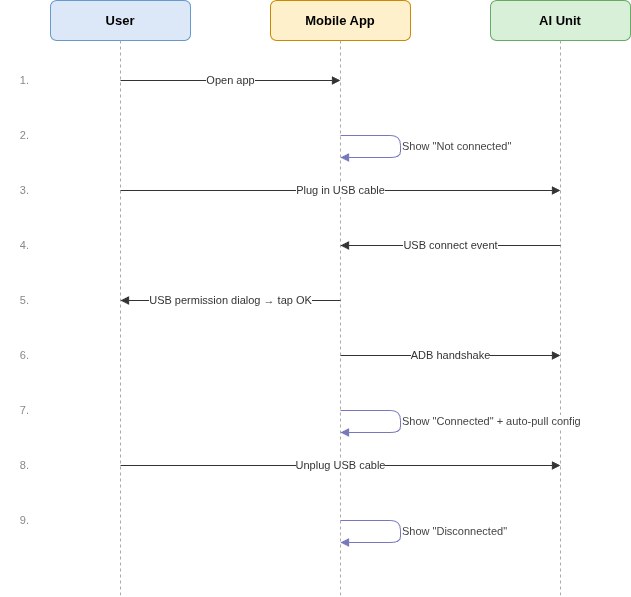
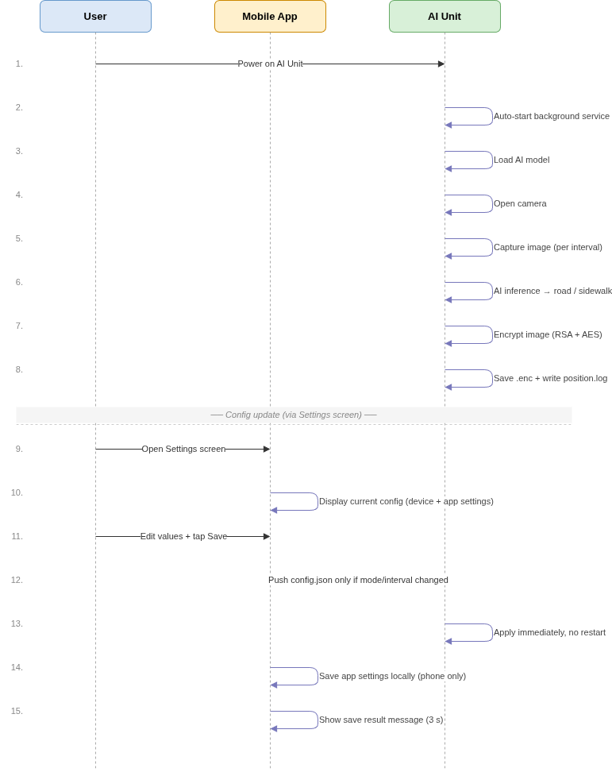
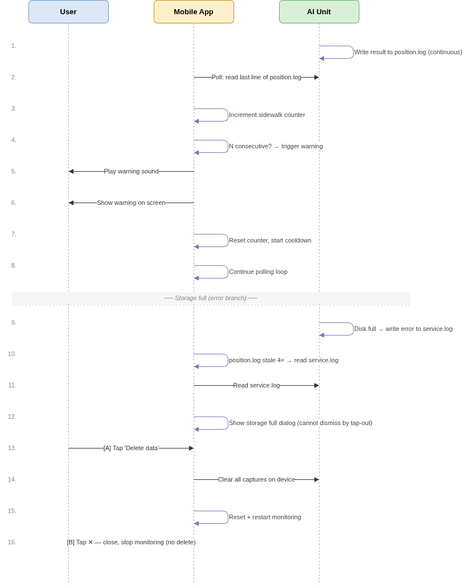
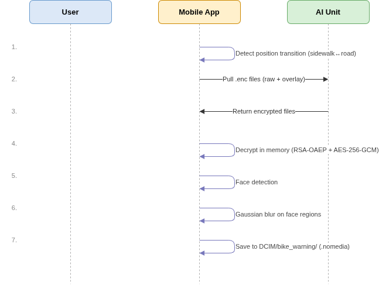

# HLD Phase 2 — 主要機能の処理フロー
## 目次

[1. 概要](#1-tổng-quan)
[2. FR-CC: Connection Checking/接続確認](#2-fr-cc--kiểm-tra-kết-nối)
[3. FR-DA: Device Application/デバイスアプリケーション](#3-fr-da--device-application)
[4. FR-LW: Location Warning/位置に基づく警告発報](#4-fr-lw--phát-cảnh-báo-vị-trí)
[5. FR-CL: Clear Sensitive Info/機微画像の処理](#5-fr-cl--xử-lý-ảnh-nhạy-cảm)
[6. 方法論](#6-phương-pháp-luận)
## 1. 概要

Bike Camera SegmentationプロジェクトのPhase 2では、4つの主要機能を追加しており、それぞれが個別のFunctional Requirement（FR）として定義されています：

| FR | 名称 | 概要 |
|---|---|---|
| **FR-CC** | Connection Checking/接続確認 | スマートフォンとAI Unit間のUSB/ADB接続状態を検知・表示する |
| **FR-DA** | Device Application/デバイスアプリケーション | 電源投入時にAI Unitが自動でサービスを起動し、画像取得・AI解析・暗号化・ログ保存を行う |
| **FR-LW** | Location Warning/位置に基づく警告発報 | スマートフォンアプリがログを定期的に読み取り、歩道走行が一定回数連続した場合に警告を発する |
| **FR-CL** | Clear Sensitive Info/機微画像の処理 | 位置変化時にスマートフォンアプリがAI Unitから画像を取得・復号し、顔ぼかし処理を行ってローカルストレージに保存する |

これら4つの機能は並行して動作し、相互に密接に連携しています：
- **FR-DA** は基盤データ（画像・位置ログ）を **FR-LW** および **FR-CL** に提供します。
- **FR-CC** はADB通信の安定性を担保し、**FR-LW** と **FR-CL** の動作前提条件となります。
- **FR-LW** は位置変化イベントを検知し、**FR-CL** の画像処理フローをトリガーします。
---
## 2. FR-CC — Connection Checking/接続確認

### 説明

FR-CCは、スマートフォンとAI Unit間の接続状態を継続的に監視し、以下の2つのレイヤーで構成されます：

- **物理接続（USB）** — ケーブルの接続／切断を即時に検知します。  
- **論理接続（ADB）** — 簡単なテストコマンドを送信し、応答を確認することで、AI Unitデバイスがコマンドを受信可能かを検証します。  

**両方のレイヤーが正常な場合のみ**、アプリは「接続済み」と表示します。  
いずれか一方でも失われた場合、アプリは即座に「未接続」に状態を更新します。  

アプリは受動的なイベント待ちではなく、周期的に接続状態をチェックします  
（未接続時：約2秒ごと、接続済み時：約5秒ごと）ことで、接続切断を迅速に検知できるようにしています。  

### フローダイアグラム

### 各ステップの説明

| ステップ | 説明 |
|---|---|
| 1 | ユーザーがアプリを起動する。 |
| 2 | アプリは初期状態として「未接続」を表示する。 |
| 3 | ユーザーがスマートフォンとAI UnitをUSBケーブルで接続する。 |
| 4 | AndroidシステムがUSBデバイスの接続を検知し、アプリへ通知する。 |
| 5 | AndroidがUSBアクセス許可ダイアログを表示し、ユーザーが **OK** を押して許可する。未許可の場合、次回チェック時に再度要求される。 |
| 6 | 許可後、アプリはADBハンドシェイク（ADB接続の確立の確認）を実行し、デバイスがコマンドを受信可能かを確認する。 |
| 7 | ハンドシェイク成功 → アプリは状態を「接続済み」に更新し、同時にAI Unitから現在の設定を自動取得する。 |
| 8 | ユーザーがUSBケーブルを抜く。 |
| 9 | AndroidがUSBデバイスの切断を通知 → アプリは即座に「未接続」に更新する。 |
---
## 3. FR-DA — Device Application/デバイスアプリケーション

### 概要

FR-DAは、AI Unitが電源投入時にどのように動作するかを定義します。  
画像取得、AI解析、暗号化、およびログ記録の一連の処理は、**ユーザーの操作なしで自動的に実行される必要があります**。

また、スマートフォンアプリは任意のタイミングで設定ファイルをAI Unitへ送信し、動作を変更することが可能です。  
新しい設定は、再起動なしで即時に適用されます。

**主な設定パラメータ:**

| パラメータ | 保存場所 | 説明 |
|---|---|---|
| `mode` | デバイス設定（AI Unit） | 動作モード：`実行中` または `一時停止` |
| `processingMode` | デバイス設定（AI Unit）| 処理モード：撮影のみ、または撮影＋解析 |
| `interval` | デバイス設定（AI Unit） | 画像撮影間隔（秒） |
| 警告するまでの歩道連続検知回数（N） | アプリ設定（スマートフォン） | 歩道の連続検知回数（この回数に達すると警告を発報） |
| 次回警告までの間隔（T） | アプリ設定（スマートフォン） | 通知間隔（2回の警告間の時間） |
| 警告テキスト／フォント | アプリ設定（スマートフォン） | 警告表示時のテキストおよびフォント設定 |

> **注意:** ユーザーがアプリ設定画面で「保存」を押した場合、`mode` または `interval` に変更がある場合のみ、アプリはAI Unitへ設定を送信します。その他の設定はスマートフォン側にのみ保存されます。

### フローダイアグラム

### 各ステップの説明

| ステップ | 説明 |
|---|---|
| 1 | ユーザーがAI Unitに電源を投入する。 |
| 2 | システムがバックグラウンドサービスを自動起動する。 |
| 3 | サービスがAIモデルをメモリに読み込む。 |
| 4 | カメラを起動し、画像撮影ループを開始する。 |
| 5 | 設定された周期で画像を撮影する。 |
| 6 | AI解析を実行し、自転車が `road`（車道） または `sidewalk`（歩道） のどちらにいるかを判定する。 |
| 7 | 保存前に画像を暗号化する。 |
| 8 | 暗号化した画像をストレージに保存し、解析結果を `position.log` に記録する。 |
| 9 | *（設定更新）* ユーザーがアプリ設定画面を開き、デバイスの現在設定およびアプリ設定を確認する。 |
| 10 | ユーザーが値を変更して **保存** を押す。アプリは保存前に妥当性を確認する（例：次回警告までの間隔 は interval × 警告するまでの歩道連続検知回数（N） より大きい必要がある）。 |
| 11 | `mode` または `interval` が変更された場合、アプリは `config.json` をAI Unitへ送信する。その他の設定はスマートフォン側にのみ保存される。 |
| 12 | AI Unitは新しい設定を即時適用し、再起動は不要である。アプリは結果通知を3秒間表示する。 |
---

## 4. FR-LW — Location Warning/位置に基づく警告発報
### 概要

FR-LWは以下の2つの要素で構成されます：

- **FR-LW-1**: AI Unitは、各解析後に分類結果（`road` / `sidewalk`）を `position.log` に継続的に記録する。  
- **FR-LW-2**: スマートフォンアプリは、`position.log` の最新行を定期的に取得する。  
  連続して **N回 `sidewalk` が検出された場合**、アプリは音声および視覚的な警告を発報する。  
  警告後はカウンタをリセットし、次回警告までの間隔が経過するまで待機する。

本警告ロジックは、自転車が短時間だけ歩道を通過した場合の誤検知を防止することを目的としています。

**注意:** N（警告するまでの歩道連続検知回数）および T（次回警告までの間隔）は、AI Unitデバイス設定ではなく**スマートフォンアプリの設定**で管理されます。

### フローダイアグラム

### 各ステップの説明

| ステップ | 説明 |
|---|---|
| 1 | AI Unitは、各解析後に `position.log` へ結果を記録する（継続動作）。 |
| 2 | スマートフォンアプリは、`position.log` の最新行を周期的に取得する。取得周期はデバイス側で設定された `interval` と同一とする。 |
| 3 | アプリは、取得した結果が `sidewalk` かどうかを確認する。`sidewalk` の場合はカウンタを加算し、`road` の場合はカウンタを0にリセットする。 |
| 4 | カウンタがN回（警告するまでの歩道連続検知回数）に達した場合、警告を発動する。 |
| 5 | 警告音を再生する。 |
| 6 | 画面上に警告メッセージを表示する。 |
| 7 | カウンタをリセットする。次回警告までの待機時間中にさらに連続 N 回が検出された場合は、警告を保留し、待機時間終了後に直ちに発報する。 |
| 8 | ステップ2に戻り、処理を継続する。 |

**警告ルール:**
- 警告は、`road` によって中断されることなく、`sidewalk` が **連続 N 回** 検出された場合にのみ発動する。  
- 警告後は、次回警告まで**T秒** 待機する。この待機中にさらに連続 N 回が検出された場合は、待機終了後に直ちに警告を発報する。  
- N（警告するまでの歩道連続検知回数）および T（次回警告までの間隔）は、AI Unitデバイス設定ではなく**スマートフォンアプリの設定**で管理されます。  

**ストレージ容量不足時の警告（エラーフロー）:**

AI Unitのストレージが満杯になると、新たな画像を保存できなくなり、`service.log` にエラーが記録されます。  
アプリは以下の仕組みにより間接的に検知します：

| ステップ | 説明 |
|---|---|
| 1 | AI Unitのストレージが満杯になる → `service.log` にエラーが記録され、`position.log` の更新が停止する。 |
| 2 | アプリは、4回連続のポーリングで `position.log` に新しい行が追加されていないことを検知する。 |
| 3 | アプリは原因を確認するために `service.log` を参照する。 |
| 4 | 「デバイスの空き容量がありません」エラーを検出した場合、ポーリングを停止し、警告ダイアログを表示する。ダイアログは画面外タップでは閉じることができない。 |
| 5a | ユーザーが **「データ削除」** を選択 → AI Unit上のすべての画像を削除し、カウンタをリセットした後、自動的に監視を再開する。 |
| 5b | ユーザーが **✕** を選択 → ダイアログを閉じ、監視を停止する（画像は削除されない）。 |

*さらに、ユーザーはスマートフォンアプリの設定画面にあるオプションボタンから、いつでも画像を削除することができます（UI/UXデザイン資料を参照）*

---
## 5. FR-CL — Clear Sensitive Info/機微画像の処理

### 概要

FR-CLは、人の顔を含む画像が、スマートフォン上に長期保存される前に適切に処理されることを保証する。  
本機能は、アプリが自転車の状態遷移（車道から歩道、またはその逆）を検知した際に自動的に起動する。

保存後の画像は、プライバシー保護のため、スマートフォンの画像ライブラリ（ギャラリー）から参照されないアプリ専用フォルダに保存される。  
また、処理中において、ぼかし処理前の元画像はストレージへ書き出されず、一時的にメモリ上にのみ保持される。

### フローダイアグラム

### 各ステップの説明
| ステップ | 説明 |
|---|---|
| 1 | アプリは、`position.log` をもとに自転車の位置状態（`sidewalk ↔ road`）の遷移を検知する。 |
| 2 | アプリは、状態遷移時点に対応する暗号化画像ファイル（`.enc`）をAI Unitからスマートフォンへ取得する。取得対象には、元画像および解析領域が描画されたoverlay画像が含まれる。 |
| 3 | AI Unitは暗号化された画像ファイルを返却する。 |
| 4 | アプリはメモリ上で画像を復号する。 |
| 5 | 画像内の顔領域を検出する。 |
| 6 | 検出された各顔領域に対してぼかし処理（Gaussian blur）を実施する。 |
| 7 | ぼかし処理後の画像をスマートフォンの `DCIM/bike_warning/` フォルダに保存する。本フォルダは `.nomedia` により画像ライブラリ（ギャラリー）から非表示となる。なお、本処理はバックグラウンドで実行され、画面上への通知は行われない。 |

**セキュリティに関する注意:**
- ぼかし前の元画像は処理時にメモリ上のみに存在し、ストレージへは保存されない。  
- AI Unit上の暗号化画像ファイルは、取得後も自動削除されない。削除はユーザー操作により別途実施される（詳細はFR-CLのデータ削除機能を参照）。  

## 6. 方法論

### ADBインターフェースに関する調査報告

お客様よりご提供いただいたデバイス（チップ：RK1808）のデータシートおよびOS情報（Linux）をもとに調査を行い、以下の通り整理いたしました。

**PC接続時の挙動**
* デバイスがUSB経由でADB接続される場合、PCがホストとして動作し、デバイスはスレーブ(制御対象)として動作する。  
* そのため、データの送受信はPC側からAI Unitへの操作（push / pull）のみが可能であり、逆方向の通信は行えない。  

**スマートフォン接続時の挙動**
* PC接続時と同様に、デバイスをスマートフォンへ接続した場合も、スマートフォンがホストとして動作し、AI Unitを制御する。  

### 顔ぼかし処理の方式

本機能では、[Google ML Kit Face Detection](https://developers.google.com/ml-kit/vision/face-detection?hl=ja) ライブラリを使用し、画像内に含まれる人物の顔を検出します。  
本ライブラリを採用した理由は以下の通りです：

* Android向けに最適化されている  
* オンデバイスで動作（端末内で処理が完結し、インターネット接続不要）  
* SDKが提供されており、導入が容易  
* 高い検出精度（約93%以上）  
* 本番環境でも無償で利用可能  