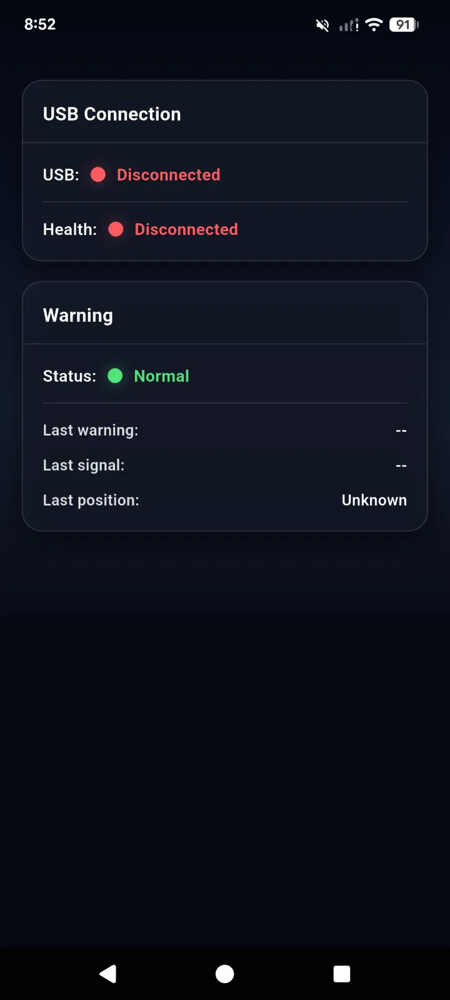
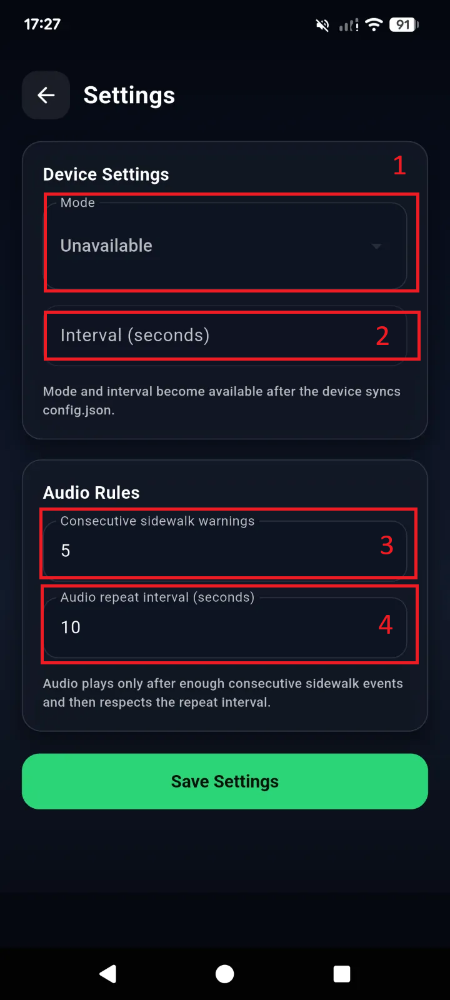

UX/UI Design
================

接続状態および位置ステータス
-----------------------------------

.. image:: img/connecttion.png
   :alt: connecttion
   :width: 400px
   :align: center 

.. list-table:: **Business Flow**
   :widths: 15 30 30
   :header-rows: 1

   * - Number
     - Desciption
     - Value
   * - 1: USB Connection
     - USB接続状態
     - ``Connection``

       ``Disconnection``
   * - 2: Warning
     - 位置ステータス
     - Status: ``Sidewark Alert`` and ``Normal``

       ログ記録

Configuration
-------------------

.. list-table:: **Business Flow**
   :widths: 15 30 30
   :header-rows: 1

   * - Number
     - Desciption
     - Value
   * - 1: Mode
     - AI Unitの動作モードを選択
     - ``Unavailable``: AI Unitとスマートフォンアプリが未接続

       ``Running``: 電源接続後にAI Unitが自動起動

       ``Stop``: AI Unitのすべての動作を停止
   * - 2: Interval
     - AI Unitの画像処理間隔を設定
     - Unit: ``seconds``

       Min: 0.2
   * - 3: Consecutive sidewalk warnings
     - 自転車が歩道を連続走行していると判定された回数がこの値に達すると警告を発する
     - Datatype: ``number``
   * - 4: Audio repeat interval (seconds)
     - 連続する警告音の間隔。この値は項目 ``2`` と ``3`` の倍数である必要がある
     - Unit: ``seconds``