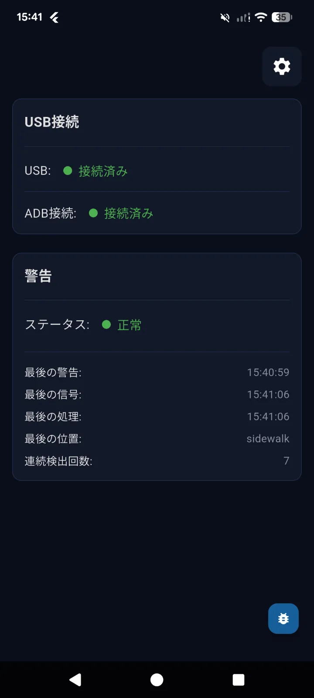
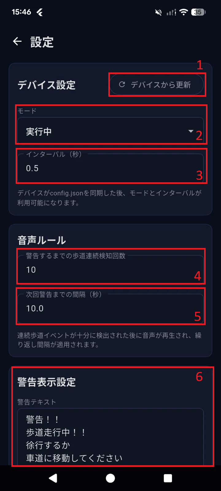
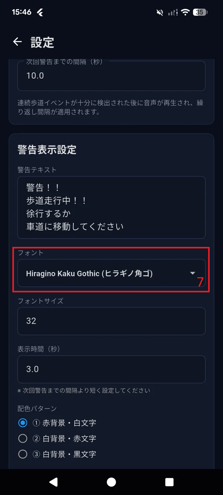
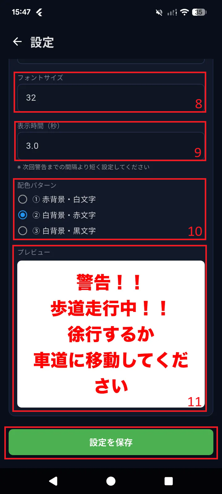
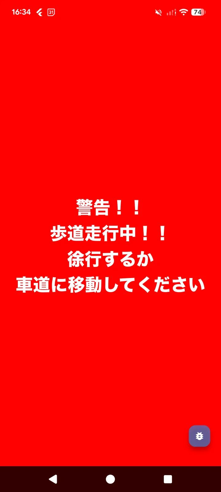

UX/UI Design
================

Connection and Location Status
-----------------------------------

.. list-table:: **Status**
   :widths: 15 30 30
   :header-rows: 1

   * - Number
     - Desciption
     - Value
   * - 1
     - 物理USB接続状態
     - ``接続済み``

       ``未接続``
   * - 2
     - ADB接続状態
     - ``接続済み``

       ``接続済み``
   * - 3
     - 位置情報ステータス
     - ステータス: ``歩道警告`` および ``正常``

       ログ情報
      
       ``最後の警告 ``: 直近でスマートフォンが警告音声を再生した時刻

       ``最後の信号``: デバイスから最新の位置情報を受信した時刻

       ``最後の処理``: 最新の位置情報を処理した時刻（現時点では「最後の信号」と同一）

       ``最後の位置``: 最後に検知された位置：歩道 または 車道

       ``連続検出回数``: 現在の歩道連続検知回数。車道が検知された場合、または警告が発報された後に 0 にリセットされる。

Configuration
-------------------

.. list-table:: **Status**
   :widths: 15 30 30
   :header-rows: 1

   * - 番号
     - 説明
     - 値
   * - 1
     - AIユニットの設定ファイルを初回取得する。AIユニット上の現在の設定内容を確認する際に使用する
     - 取得した情報は項目2および3に反映される
   * - 2
     - AIユニットの動作モードを選択する
     - ``利用不可``：AIユニットとスマートフォンアプリが未接続のため、デフォルトでは設定情報は未取得の状態となる。

       ``実行中``：電源接続後、AIユニットが自動的に起動する

       ``一時停止``：AIユニットのすべての動作を停止する
   * - 3
     - 連続する2回の自転車位置検知間隔を設定する
     - 単位：``秒``

       最小値：0.2
   * - 4
     - 歩道の連続検知回数（この回数に達すると警告を発報）
     - データ型：``数値``

       単位：``回``
   * - 5
     - 通知間隔（2回の警告間の時間）。本値は項目 3 × 4 の値より大きく設定する必要がある。
     - 単位：``秒``
   * - 6
     - スマートフォン画面に表示する警告テキスト
     - テキスト形式で入力可能（任意入力）

       制限：全角30文字以内
   * - 7
     - 警告テキストのフォントを設定する
     - 選択式。対応フォント：

       MS Gothic（ＭＳ ゴシック）

       MS Mincho（ＭＳ 明朝）

       Meiryo（メイリオ）

       Yu Gothic（遊ゴシック）

       Yu Mincho（遊明朝）

       Hiragino Kaku Gothic（ヒラギノ角ゴ）
   * - 8
     - 警告テキストの文字サイズを設定する
     - 入力形式：数値入力
   * - 9
     - 警告テキストの表示時間を設定する
     - 単位：``秒``
   * - 10
     - フォント色および背景色を変更する
     - 選択式
   * - 11
     - 警告テキストのプレビュー表示
     - プレビュー画像
   * - 12
     - 設定内容を保存し、スマートフォンアプリに反映する
     -  
Error Notification
-----------------------

